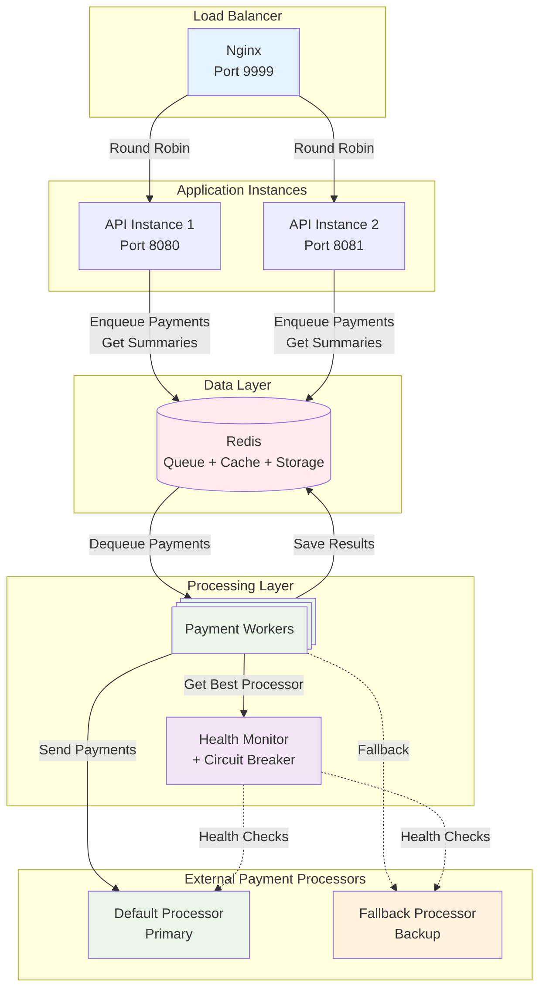
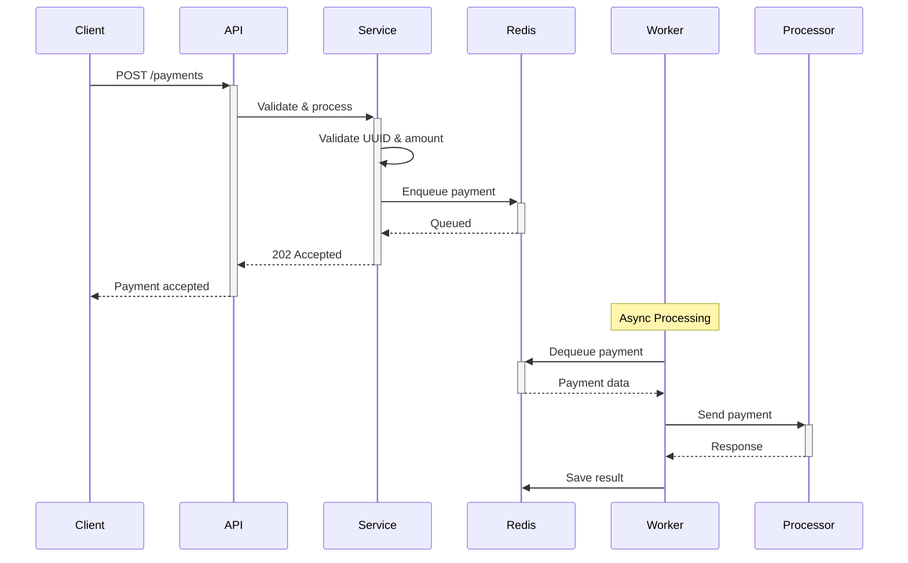
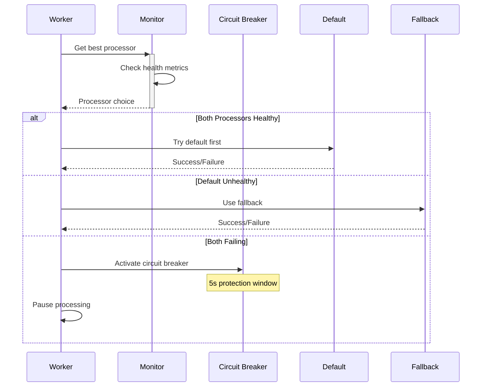
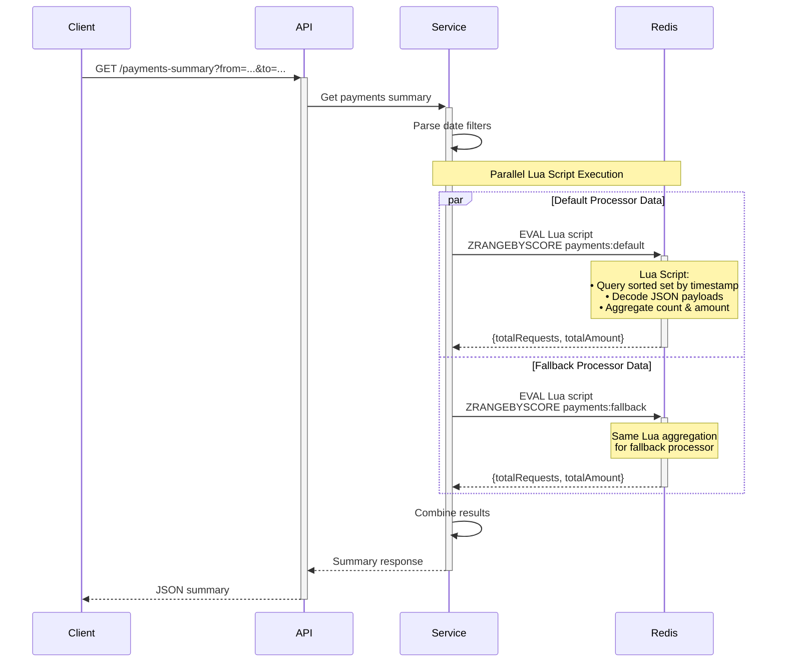

# Rinha de Back-end 2025

> ⚠️ **Disclaimer**: This code is optimized for competition performance and should not be used as-is in production environments. Some practices prioritize speed over traditional production best practices.

High-performance payment processing system built for the Rinha de Back-end competition by @zanfranceschi.

Competition repository [here](https://github.com/zanfranceschi/rinha-de-backend-2025).

## Tech Stack

- **Clojure 1.12.1** - Functional programming language
- **HTTP-kit** - High-performance HTTP server
- **Reitit** - Data-driven routing library
- **Redis 7** - In-memory data store for queuing and caching
- **Nginx** - Load balancer and reverse proxy

### System Features

- **Circuit Breaker Pattern** - Automatic failure detection and recovery
- **Health Monitoring** - Real-time processor health checks
- **Async Workers** - Background payment processing
- **Load Balancing** - Multiple API instances with Nginx
- **JVM Tuning** - Optimized for low-latency performance

## How to Run

T.B.D

The API will be available at `http://localhost:9999`

## API Endpoints

### Create Payment

`POST /payments`

```json
{
    "correlationId": "550e8400-e29b-41d4-a716-446655440000",
    "amount": 1000.50
}
```

**Response:**

```json
HTTP 202 Accepted
{
    "message": "Payment processed successfully"
}
```

### Health Check

`GET /`

```json
{
    "message": "Hello, World!",
    "status": "success",
    "timestamp": 1703123456789
}
```

### Payments Summary

`GET /payments-summary?from=2024-01-01T00:00:00Z&to=2024-01-31T23:59:59Z`

```json
{
    "default": {
        "totalRequests": 1500,
        "totalAmount": 75000.00
    },
    "fallback": {
        "totalRequests": 300,
        "totalAmount": 15000.00
    }
}
```

## System Architecture



## Payment Processing Flow

### Main Request Flow



### Circuit Breaker & Health Monitoring



## Payment Summary Flow


